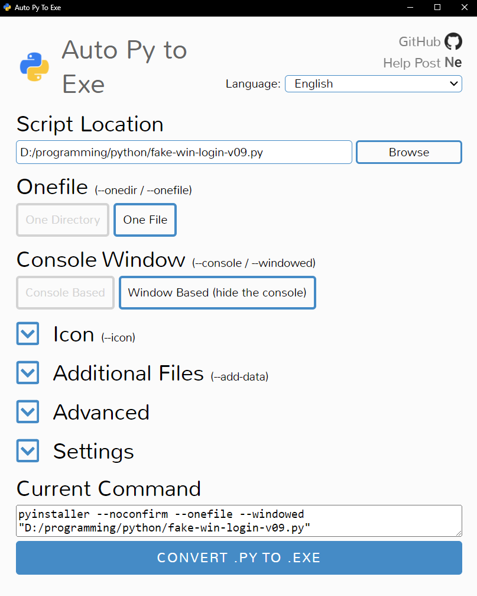

# fake-login-credential-stealer
Fake Windows login page

>The python code show a windows background with login username and password fields, when enterring credential details, it is saved to file and then send to python server waiting for the post request on port 80.  

>Compile the python code using ```ayto-py-to-exe``` with following commands on a Windows OS client.  

```dos
pip install auto-py-to-exe
pip install easygui
auto-py-to-exe
```  

  

>Sample of the fake windows login screen.  

  

>Start the python listender program to receive post request with credentials being harvested.

```
python ..\upload-server.py
```

>NoteL: This penetration activity may require physical access to the targeted machines as the plan is to have this code run from usb and then removing the USB in red team exercise.  
